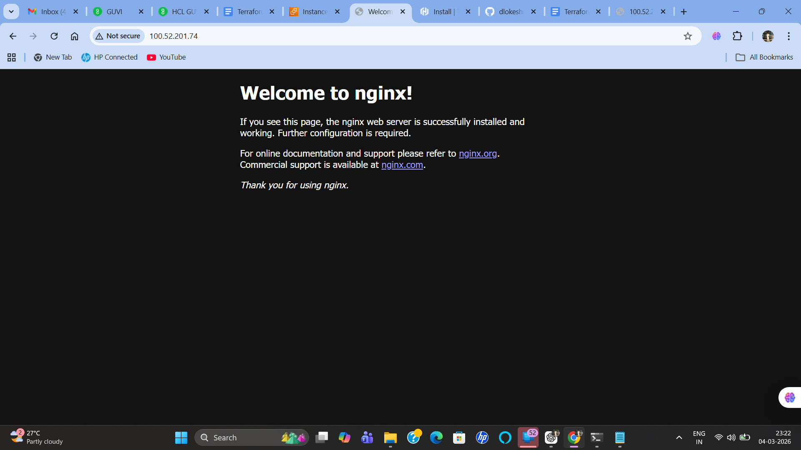

# Terraform Nginx Multi-Region Deployment

This project provisions EC2 instances in two different AWS regions and installs Nginx automatically using Terraform.

## Tech Stack
- AWS EC2
- Terraform
- AWS CLI

## Regions Used
- us-east-1
- us-west-2

## Features
- Multi-region EC2 deployment
- Automatic Nginx installation using user_data
- Infrastructure as Code with Terraform

## Terraform Commands Used

terraform init  
terraform plan  
terraform apply  
terraform destroy

## Output

Nginx running on EC2 instance:

